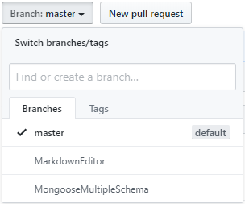

# NodeJSSamples
There are 2 examples provided here.
Please switch branches for the actual code by clicking the branches link above.

1) Mongoose Multiple Schema  
Demo - https://www.youtube.com/watch?v=d3yo2TF4i08
2) Markdown Editor  
Demo - https://www.youtube.com/watch?v=INCYGjHIoBU

How to access different branches, click on Branches option (top left)

Read our Documentation [here](https://docs.prolifics.com)
